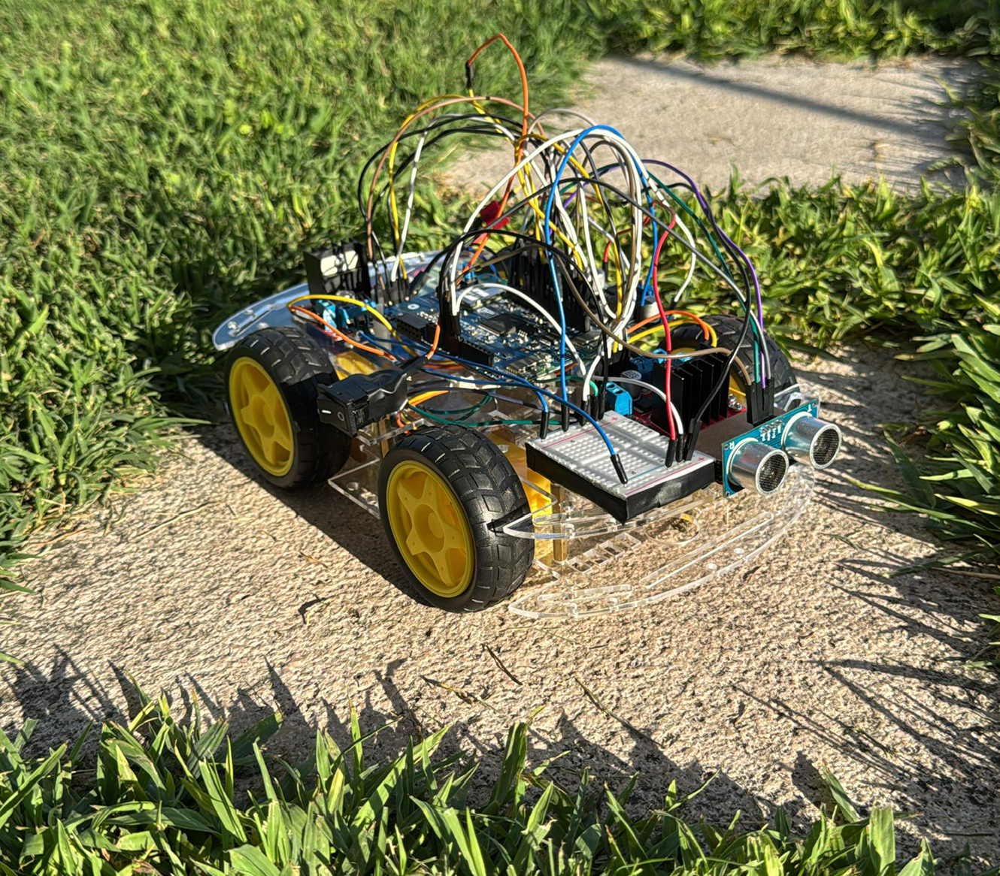

# GarenCaren

<p align="center">
  
</p>

<p align="center">
  
  
  
</p>

Un progetto embedded realizzato in C per un robot autonomo basato su MCU STM32L475VGTX. Il firmware gestisce la movimentazione dei motori, il controllo del servo, la lettura del sensore ultrasonico e la logica di navigazione del veicolo.

## ✨ Panoramica

Questo repository contiene il firmware del robot `GarenCaren`, sviluppato con STM32CubeIDE e configurato tramite `.ioc` per il microcontrollore STM32L475VGTX.

Le funzionalità principali includono:

- controllo PWM dei motori DC
- gestione direzione avanti/indietro e rotazione
- controllo del servo per scansione di ambiente
- rilevamento distanza mediante sensore ultrasuoni
- logica di movimento e navigazione autonoma
- firma hardware compatibile con driver motore e modulo ultrasonico

## 🔧 Hardware e architettura

Il progetto usa:

- MCU: STM32L475VGTX
- Timer: `TIM2` e `TIM3`
- Motori: 4 ruote controllate tramite PWM + GPIO
- Servo: controllo angolare via `TIM3_CH4`
- Sensore ultrasuoni:
  - `TRIG` output
  - `ECHO` input

### Componenti principali

- `Core/Src/main.c`: logica principale del firmware
- `Core/Inc/main.h`: definizioni pin, configurazioni e costanti
- `GarenCaren.ioc`: configurazione CubeMX/STM32CubeIDE
- `Startup/`: boot code del microcontrollore

## 🧠 Funzioni del firmware

Il firmware implementa funzioni di controllo come:

- `Servo_SetAngle()`
- `misura()` per la distanza tramite ultrasuoni
- `mot_on()`, `mot_stop()`, `mot_turn()`
- `set_mot_spin_destra()`, `set_mot_spin_sinistra()`
- `set_mot_curva_destra()`, `set_mot_curva_sinistra()`
- `path_finding()` e funzioni di scansione ambientale

Il codice mostra una logica robotica orientata a:

1. muoversi in avanti
2. rilevare ostacoli
3. ruotare per trovare una direzione libera
4. usare il servo per analizzare gli spazi attorno al robot

## 📌 Pinout del robot

Di seguito il pinout riportato e validato come mappatura del robot, con la disposizione dei segnali sui canali di controllo e del sensore ultrasonico.

| Pin | Funzione | Posizione |
|---|---|---|
| D0 | in1 | davanti |
| D1 | in2 | davanti |
| D2 | in3 | dietro |
| D3 | enb | davanti |
| D4 | ena | davanti |
| D5 | vuoto | - |
| D6 | vuoto | - |
| D7 | in3 | davanti |
| D8 | in2 | dietro |
| D9 | enb | dietro |
| D10 | ena | dietro |
| D11 | trigger | - |
| D12 | in1 | dietro |
| D13 | in4 | davanti |
| D14 | in4 | dietro |
| D15 | echo | - |

> Nota: questa sezione riporta la mappatura logica del robot così come definita dal progetto/uso del veicolo. In caso di revisione hardware, va verificata la corrispondenza reale con la scheda elettronica finale.

## 🧩 Mappatura STM32 rilevata nel progetto

La configurazione del progetto mostra i pin reali del microcontrollore assegnati alle funzioni principali:

- `PA0` → `motASX2`
- `PA1` → `motASX1`
- `PA4` → `motPDX1`
- `PA5` → `motPDX2`
- `PA6` → `motADX1`
- `PA7` → `TRIG`
- `PB1` → `servo`
- `PB2` → `motADX2`
- `PB8` → `ECHO`
- `PB9` → `motPSX2`
- `PD14` → `motPSX1`

Inoltre:

- `TIM2_CH1` e `TIM2_CH3` usati per PWM dei motori
- `TIM3_CH1` e `TIM3_CH3` usati per i motori
- `TIM3_CH4` usato per il servo

## 🚀 Build e sviluppo

Per aprire e compilare il progetto:

1. aprire il file `GarenCaren.ioc` con STM32CubeIDE
2. compilare il firmware
3. collegare il board STM32 via SWD/ST-Link
4. eseguire il caricamento del binario

Il progetto è strutturato per essere facilmente esteso con:

- più logiche di evasione ostacoli
- controllo remoto o telemetria
- calibrazione dei motori e del servo
- gestione di sensori aggiuntivi

## 🛠️ Struttura del repository

```text
GarenCaren/
├── Core/
│   ├── Inc/
│   │   └── main.h
│   └── Src/
│       └── main.c
├── Drivers/
│   ├── CMSIS/
│   └── STM32L4xx_HAL_Driver/
├── Startup/
│   └── startup_stm32l475vgtx.s
├── GarenCaren.ioc
├── README.md
├── STM32L475VGTX_FLASH.ld
├── STM32L475VGTX_RAM.ld
└── GarenCaren Debug.launch
```

## 📎 Note

Questo progetto è pensato come base per un robot mobile autonomo con sensore ultrasonico e controllo motorio. La parte più interessante del firmware è la combinazione tra:

- PWM dei motori
- inversione di direzione
- scansione servo
- rilevamento ostacoli
- navigazione con decisioni in base alla distanza

## ✅ Status

Il progetto è in fase di sviluppo firmware e configurazione hardware, con logica di movimento e sensori già implementata nel codice principale.


